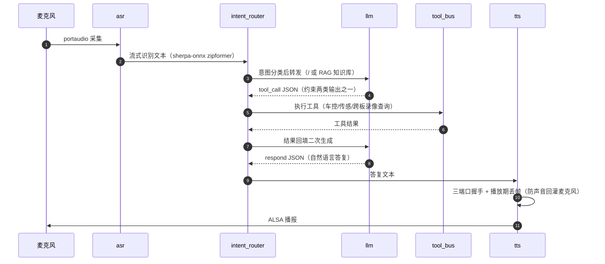

# 聆行 VoxDrive — 分布式车载智能座舱系统（RK3588 + Jetson Orin 双板）

> 双 SoC 分布式车载智能座舱：**RK3588 作为行车记录媒体节点**（V4L2 摄像头采集 / MPP 硬件编码 / MP4 分段循环存储 / RTMP 推流），**Jetson Orin 作为端侧 AI 语音节点**（流式 ASR / LLM / RAG / TTS / Qt 座舱界面）。两板以太网互联，视频流走 RTMP、控制与状态走 ZeroMQ，实现"语音控制行车记录、画面预览、录像与存储状态查询"的跨节点闭环。

**状态：开发中（WIP）**

- ✅ Jetson 侧：七服务收编自上一代单体语音座舱并完成标准重构，全栈一键启动 + 回归测试 4/4 PASS
- ✅ RK3588 侧：采集（30.0fps）→ MPP 硬编 → MP4 分段循环存储 → RTMP 推流 → ZMQ 状态/事件服务，全链路板上自测 PASS
- 🚧 端到端实测收口：ASR/TTS 段延迟对账、长稳（跨板语音闭环与延迟分解已实测）

## 系统架构

```
[IMX415 摄像头]
      │ MIPI CSI-2 (4-lane)
      ▼
  rkcif ──► rkisp(3A) ──► NV12 (/dev/video11)
      │
      ▼
RK3588（行车记录媒体节点）
 V4L2 采集 ──NV12 直入──► MPP H.264 硬编码(VBR)
                              │ 编码帧扇出（IVideoSink）
                 ┌────────────┴────────────┐
                 ▼                         ▼
        Mp4SegmentSink                  RtmpSink
     MP4 分段循环存储                    RTMP 推流
     · 段边界只在 I 帧                   · flv 封装
     · 水位监控·最旧覆盖                 · 断连 I 帧+冷却重连
     · 写失败断链恢复                    （目的：Jetson mediamtx）
                 │                         │
                 └──► recorder_service ◄───┘
                       │  REQ/REP :6700  状态查询·录像开关
                       │  PUB    :6701  分段/水位/断流事件
                       ▼ 以太网（控制面 ZMQ / 数据面 RTMP）
Jetson Orin（端侧 AI 语音节点）
  麦克风 ─► ASR ─► Intent Router ─┬► RAG（车辆知识库问答）
                                  ├► LLM（Qwen2.5 GGUF，llama.cpp 全离线）
                                  ├► Tool Bus ──► 跨板工具（录像/存储查询、抓拍、预览）
                                  └► TTS ─► 扬声器
  Qt Dashboard：座舱状态 + 行车记录画面预览 + 录像/存储面板
```

**任务划分原则**：数据密集型任务走专用加速器（RK3588 的 VPU/RGA/NPU），模型密集型任务走中心算力（Jetson GPU/统一内存）。主码流 NV12 由 ISP 直出、免格式转换直入 MPP，RGA 不在主链路，预留做子码流缩放与格式适配。

## 功能流程

### 1. 行车记录管线（RK3588）

```
IMX415 (RAW Bayer, 4-lane MIPI)
  └─► rkcif ──► rkisp（3A 统计，rkaiq 引擎按需启用）
        └─► mainpath /dev/video11 输出 NV12 1920x1080@30fps
              └─► V4L2Capture：mmap 4 缓冲轮询出队，DMA-BUF 导出
                    └─► MppEncoder：NV12 直入 MPP 编码 H.264（VBR 4Mbps，GOP 2s）
                          ├─► Mp4SegmentSink ──► ~/voxdrive_records/seg_YYYYmmdd_HHMMSS.mp4
                          └─► RtmpSink      ──► rtmp://<mediamtx>/live/dashcam
```

- **分段循环存储**：段边界严格落在 I 帧（每段独立可解码）；PTS 在段内归零后重采样到 1/90000 时基；`statvfs` 监控磁盘水位，超过阈值（默认 85%）按最旧优先删除已关闭段，**永不删正在写的当前段**；写失败（磁盘满/设备掉线）立即关闭当前段，在下一个 I 帧自动重开新段——长时间录制不中断。
- **推流与存储互不牵连**：RTMP 断连时推流侧只丢弃非 I 帧，按"I 帧到达 + 冷却期满"节奏重连，录像管线不受影响；两路消费者互为独立实现，均挂在 `IVideoSink` 接口下，可单独启停或替换。

### 2. 状态查询与事件上行（ZMQ 双通道）

所有跨板消息使用统一信封，新增数据类型（GPS/IMU/检测事件…）只需扩展 `type` 字段，不改协议：

```json
{"version": 1, "type": "status", "timestamp_ms": 1725360000000,
 "source": "rk.recorder", "payload": {"cmd": "status"}}
```

**REQ/REP（:6700，控制面）**——Jetson 侧随时查询与控制：

```json
{"recording": true, "pipeline_fps": 30.0, "frames_encoded": 474, "uptime_s": 15.8,
 "storage": {"dir": "...", "segments_total": 4, "used_percent": 52.0, "free_gb": 13.9},
 "rtmp": {"...": "推流状态快照"}}
```

支持命令：`status`（如上快照，含 `preview` 与 `rtmp` 字段）、`set_recording`（录像开关，暂停期间编码照常、仅不落盘）、`set_preview`（预览推流开关，关=立即断流、开=下个 I 帧自动重连）、`snapshot`（应答信封 type=snapshot，携带 `jpeg_b64`）。

**PUB/SUB（:6701，事件面）**——异常实时上行座舱告警：

| 事件 | 触发条件 |
|---|---|
| `segment_opened` / `segment_closed` | 分段滚动 |
| `watermark_deleted` | 磁盘超水位，删除最旧段 |
| `write_error` | 写失败进入断链恢复 |
| `capture_timeout` | 采集超时断流（只报首次，防风暴） |

### 3. 语音问答链路（Jetson，全离线）



规则与语义两路意图识别；LLM 输出被约束为 `respond` / `tool_call` 两类 JSON，工具调用走"调用→回填→再生成"两段循环。跨板工具（录像/存储状态查询、抓拍、预览开关）由 tool_bus 经上述 ZMQ 双通道访问 RK 节点。

**行车记录仪（dashcam）域走确定性直通**：关键词命中即直接执行跨板工具，LLM 仅负责把真实工具结果组织成播报文本——不把真设备控制交给 1.5B 小模型在 7 个工具间选择（实测它会选错："关闭预览"→车窗全关、"还剩多少存储"→读 mock 传感器编数）。异常事件（水位删除/写失败/采集超时/推流中断）由 RK 经事件 PUB 上行，dashboard 订阅后弹告警横幅。

## 实现方案

### RK3588 侧（`rk/`）

**接口分层**——采集与消费解耦，一帧编码输出可多路扇出：

```cpp
IVideoSource  { start / stop / acquire / release }      // V4L2Capture 实现
IVideoSink    { start(sps_pps) / on_packet / stop }      // Mp4SegmentSink、RtmpSink 实现
EncodedPacket { Annex-B H.264 访问单元 + is_keyframe + 时间戳 }
```

| 模块 | 实现要点 |
|---|---|
| `capture/v4l2_capture` | mplane API；格式以 `G_FMT` 实际协商值为准；`REQBUFS`+`mmap` 4 缓冲、`EXPBUF` 导出 DMA-BUF；分片 `poll` 等待保证停流响应；`STREAMOFF` 安全停止 |
| `encode/mpp_encoder` | NV12 同制式直入 MPP（零格式转换）；VBR 目标 4Mbps（1.5x/0.5x 上下限）；GOP=fps×2s；`MPP_ENC_GET_EXTRA_INFO` 取 SPS/PPS；关键帧判定扫描包内**全部** NAL（MPP IDR 包带 SEI 前缀，只看首 NAL 会漏判） |
| `storage/mp4_segment_sink` | libavformat 封装；movenc 不代转 Annex-B——写帧前逐 NAL 转 AVCC 4 字节长度前缀，SPS/PPS 手工组装 avcC extradata；起始码前导零归属、末 NAL 边界两处 off-by-one 用统一扫描器解决（症状是 duration 正常但解码全错，必须逐段解码校验） |
| `stream/rtmp_sink` | flv over RTMP（libavformat，与 MP4 共用 AVCC 转换）；连接超时/读写超时分离；断连后丢弃非 I 帧，按"I 帧 + 冷却间隔"重连，重连成功即恢复完整可解码流 |
| `service/recorder_service` | 管线线程（采集→编码→扇出）+ 控制线程（REP 500ms 轮询）分离；状态快照跨线程加锁（帧率 EWMA 平滑）；事件经 ZmqPub 上行；启动就绪用原子量轮询，杜绝"管线未起即判死"竞态 |

**ZMQ 通信**：复用自研 `zmq-comm-kit`（REQ/REP + PUB/SUB 封装，C++），板端直链编译。

### Jetson 侧（`jetson/`）

- **公共地基 `common/`**：`voxdrive.conf` 统一管理全部端口/路径/超时（含 RK 节点地址，网络形态变化不改代码）；`vox_log` 毫秒时间戳日志（延迟对账地基）；`msg_envelope` 跨板消息信封；vendored nlohmann/json。
- **七服务**：asr（sherpa-onnx 流式 zipformer 双语）、intent_router（规则+语义双路，`respond`/`tool_call` 两类 JSON 约束）、rag（车辆手册向量库，阈值过滤）、llm（llama.cpp server HTTP 代理）、tool_bus（本地车控/传感工具 + 跨板工具注册表预留）、tts（SummerTTS/VITS + 三端口握手 + 播放期丢帧防回灌）、dashboard（PyQt5，面板插槽化，预留视频预览/状态面板）。
- **编排与回归**：`start_core.sh` 路径无关、全 conf 驱动、按依赖排序启动 + 端口健康检查；`run_regression.sh` 4 条典型查询全链路验证。

### 工程化

- **Git 为唯一真源**：本地提交 → `git archive | ssh tar` 增量送板（只送已提交内容）→ 板上编译自测；测试程序放板上独立目录，不污染项目树。
- **板端编译**：RK 侧 g++/cmake 板上原生编译，MPP/RGA 用发行版 dev 包；ffmpeg 头文件经 `setup_ffmpeg_headers.sh` 解包到项目前缀（发行版 rkmpp 运行库与官方 dev 包冲突，不可 apt 安装），链接系统运行库。
- **自测判据硬性化**：每个环节的测试都有 PASS 判据（帧率阈值、逐段全量解码零错误、双通道应答断言），不允许"能跑就算过"。

## 仓库结构

```
jetson/                       # Jetson 侧
  config/voxdrive.conf        #   统一配置（端口/路径/超时/RK 节点地址）
  common/                     #   配置读取·毫秒日志·JSON·消息信封（节点无关）
  services/                   #   asr / intent_router / rag / llm / tool_bus / tts
  dashboard/                  #   PyQt5 座舱界面
  scripts/                    #   增量送板·板上编译·自测·启动编排·回归
rk/                           # RK3588 侧（接口化设计）
  include/vox/                #   IVideoSource / IVideoSink / NAL 工具
  capture/ encode/ storage/ stream/ service/
  apps/                       #   test_capture / test_encode / test_record / test_rtmp / test_recorder_client
  scripts/                    #   增量送板·板上编译·依赖部署
docs/                         # 工程文档（补充中）
```

## 构建与部署

**RK3588（LubanCat-4 / RK3588S，Ubuntu 22.04）**：

```bash
rk/scripts/setup_ffmpeg_headers.sh   # ffmpeg 头文件前缀（幂等）
rk/scripts/setup_zmq_kit.sh          # zmq-comm-kit 拷板编译（PC 端执行）
rk/scripts/sync_to_rk.sh             # git archive 增量送板（PC 端执行）
rk/scripts/build_on_rk.sh            # 板上编译
# 板上自测：apps/ 下 test_capture / test_encode / test_record / test_rtmp / test_recorder_client
```

**Jetson Orin Nano Super（JetPack 6.x）**：

```bash
jetson/scripts/build_on_board.sh <service>   # 板上编译单个/全部服务
jetson/scripts/start_core.sh                 # Jetson 侧一键全栈（依赖排序 + 端口健康检查）
jetson/scripts/run_regression.sh             # 回归测试
```

模型文件不入库，按清单部署（LLM/ASR/TTS/embedding 四类约 1.7GB）；mediamtx 等第三方二进制另行部署。

### 快速启动（双板一键，Jetson 上执行）

前置（一次性）：Jetson→RK SSH 免密（Jetson 公钥装入 RK `authorized_keys`）。

```bash
~/Desktop/VoxDrive/jetson/scripts/start_all.sh    # 双板一键：探测/SSH 拉起 RK 录像服务 → Jetson 全栈（含 mediamtx）→ 开预览推流；冷启动实测 23.5s
~/Desktop/VoxDrive/jetson/scripts/stop_all.sh     # 双板一键停止
# 可选：--no-preview 只录像不推流；VOX_START_DASHBOARD=1 同时启动 Qt 座舱 GUI（需桌面会话）
```

启动后即可用键盘注入语音查询（走完整 router→跨板工具→LLM→TTS 链，扬声器播报）：

```bash
python3 ~/Desktop/VoxDrive/jetson/services/asr/stdin_asr.py
# 逐行输入，Ctrl+C 退出：
#   现在录着吗              → 播报真实状态（录像/预览/帧率/水位，rtt=2ms）
#   行车记录仪还剩多少存储    → 播报剩余容量（实测值）
#   帮我拍张照               → 1080p JPEG 落盘 Jetson ~/voxdrive_snapshots/
#   停止录像 / 开始录像       → 真实开关 RK 录像并回读确认
#   打开预览 / 关闭预览       → 开关 RTMP 推流
#   打开空调制冷模式          → LLM 工具两段循环（演示 mock 车控路径）
```

同一网段浏览器打开 `http://<jetson-ip>:8888/live/dashcam` 可直接观看行车画面（HLS）。

## 实测数据

> 全部数字为板上实测，附测量方法；未实测项留空不填。

| 指标 | 数值 | 测量方法 | 状态 |
|---|---|---|---|
| LLM 生成速度（Qwen2.5-1.5B Q4_K_M, Jetson Orin Nano Super, -ngl 28 全层 offload） | 22.8 token/s | llama-server 非流式单请求 usage 分解计时（`selftest_llm.sh`，2026-09-03） | 已实测 |
| RAG 检索延迟（CPU 嵌入，45 文档库） | 稳态 ~210 ms/查（首查 591 ms 含预热） | `selftest_rag.sh` REQ 计时，2026-09-03 | 已实测 |
| 语音链路查询延迟（文本→最终答复，含 2 次 LLM 调用+工具执行） | 2.0-5.1 s/条 | `run_regression.sh` 4 条 canned 查询，2026-09-03 | 已实测（不含 ASR/TTS 播报） |
| TTS 播报端到端（合成+ALSA 播放） | 2.7 s（"启动自检测试"短句） | `selftest_tts.sh` 三端口握手计时，2026-09-03 | 已实测 |
| 1080p 采集帧率（RK, IMX415→rkisp NV12） | 30.0 fps（120 帧，max 帧间距 33ms） | `test_capture` 驱动时间戳统计，2026-09-03 | 已实测 |
| 1080p 采集→MPP H.264 硬编（RK） | 30.0 fps；编码延迟 avg 4.8ms / max 8.5ms；全链路 CPU ~2.8%（单核）；静态场景 VBR 实际 0.55Mbps（目标 4Mbps，GOP 2s 节奏 5/5 I 帧）；ffprobe/ffmpeg 全量解码零错误 | `test_encode` 300 帧 + 板上 ffmpeg 校验，2026-09-03 | 已实测 |
| MP4 分段循环录像（RK） | 10s→3 段（测试段长 3s），段边界严格 I 帧；每段 ffmpeg 全量解码零错误；水位触发按最旧序删段且当前段幸免 | `test_record` 分段+水位双相位，2026-09-03 | 已实测 |
| RK ZMQ 服务（REQ 状态查询 / PUB 事件上行） | 状态查询含 recording/pipeline_fps/存储水位（used 52% 实测）；录像开关 off/on 应答正确；慢加入者 SUB 收到 `segment_closed` 事件信封；16s 试跑 4 段全部 ffprobe 有效 | `test_recorder_client` REQ+SUB 双通道自测，2026-09-03 | 已实测 |
| RTMP 推流（回环+跨板真机） | 回环：推流 408 帧与录像一致、断链重连管线不崩；**跨板（RK→路由器→Jetson mediamtx）**：RTSP 拉流 ffprobe h264 1920x1080 30fps、30.2s 全量解码零错误、实测码率 0.71Mbps（静态 VBR 下探，目标 4Mbps），PC 可经 HLS :8888 访问 | `test_rtmp` 回环 + mediamtx v1.20.1 部署后 ffprobe/ffmpeg 拉流，2026-09-04 | 已实测 |
| dashboard 拉流预览 + 状态面板 | ffmpeg 拉 RTSP→BGRA 960x540→Qt 渲染（断流 2s 自动重连）；状态卡片 5s 轮询 RK（30.0fps/段数/水位条实时回读）；REC/预览/抓拍按钮经 tool_bus 控真设备；在线→离线跳变弹告警 | offscreen 截图 + 按钮链路实测，2026-09-04 | 已实测（预览偏绿=暗光下无 3A 传感器表现，调优项） |
| 跨板语音闭环（dashcam 域 6 类查询：状态/存储/抓拍/录像开关×2/预览开关） | 6/6 命中真实设备：应答含实测值（磁盘 52%/剩余 14.6GB、快照 1920x1080 183KB 落盘 Jetson）；RK 状态回读与指令一致。延迟分解（文本进入→TTS 文本发出）：控制类 0.43-0.53s、状态查询 1.0-2.1s、抓拍 3.3s；其中跨板工具 RTT 仅 2-10ms（抓拍 150ms 含 RK 端 JPEG 编码+183KB 跨板传输），其余为 LLM 组织耗时 | intent_router 毫秒日志逐级打点，2026-09-04 | 已实测（ASR 麦克风入口与 TTS 播放时长未计入，stdin_asr 注入文本） |
| 异常事件→dashboard 告警（跨板 PUB/SUB） | RK 水位删除事件（`--watermark 40` 触发真实删除）经 :6701 PUB 上行，Jetson dashboard 订阅实时收到并弹告警横幅；事件信封含 file/segments_deleted/used_percent。注意两板时钟偏差 ~4.2s（Jetson 快），跨板延迟对账以信封 `timestamp_ms` 为准 | RK 服务日志与 dashboard 事件日志对账，2026-09-04 | 已实测 |
| 语音端到端延迟（ASR→TTS 播报结束） | 分解（文本注入口径，4 条代表查询）：入口→router 应答 0.87-1.04s（关键词命中 <1ms + 跨板工具 RTT 2-10ms/抓拍 143ms + LLM 组织 0.86-1.07s）；TTS 合成+播放 6字句 2.68s / 15字句 4.49s（含音频时长本身）；**全程→play_end 3.55-5.47s**。ASR 引擎段（WAV 回放口径）：流式 zipformer int8 双线程 RTF 0.16-0.18（4.69s 音频纯解码 0.83s，模型加载 2.5s 一次性摊销），中英混识别正确；真实 mic 口径含 VAD 端点静音窗，需真人测试（未计入） | intent_router/tts 毫秒日志 + play_end PUB 事件 + sherpa-onnx CLI 计时，2026-09-04 | 已实测 |
| 长稳快照（双板全栈联跑） | 16min：RK 管线 fps 稳定 30.00、29417 帧编码、frames_dropped=765 与"录像暂停"总时长精确对账（设计性丢弃）；RSS 稳定 recorder 53MB / tts 371MB / mediamtx 47MB / tool_bus 8MB；期间跨板查询/抓拍/预览/回归全部正常；离线注入故障（杀 RK）→ 5s 精确超时应答、总线存活、恢复即自愈 | 双板进程状态 + RK status 快照 + 日志对账，2026-09-04 | 已实测（过夜长稳挂起中） |
| 跨板查询往返延迟 | REQ rtt=2ms（Jetson tool_bus → RK recorder_service，ZMQ 消息信封，路由器当交换机同段） | `dashcam` 工具联测计时，2026-09-04 | 已实测 |
| 跨板抓拍（JPEG over ZMQ） | 1080p JPEG ~195KB（NV12→mjpeg 软编 + base64 REQ/REP）跨板落盘 Jetson，`file` 验证有效图像；录像/预览开关状态回读一致 | `dashcam` 全动作联测，2026-09-04 | 已实测 |

## Roadmap

- [x] zmq-comm-kit 通信库上 Jetson 编译验证（REQ/REP + PUB/SUB 回环）
- [x] Jetson 七服务收编 + 标准重构（统一配置/公共 JSON/毫秒日志/死代码清理；七服务全部板上自测 PASS，`start_core.sh` 一键全栈启动 + `run_regression.sh` 4/4 PASS）
- [x] mediamtx v1.20.1 RTMP/RTSP/HLS 服务上 Jetson（`start_core.sh` 一键编排；gh-proxy 镜像获取）
- [x] RK3588 硬件链路验证 + 采集层（野火 LubanCat-4/RK3588S + IMX415 MIPI；`IVideoSource`/`IVideoSink` 接口抽象 + `V4L2Capture` mmap/DMA-BUF 实现，NV12 1920x1080 实测 30.0fps 板上自测 PASS）
- [x] RK3588 MPP H.264 硬编（NV12 直入 VBR，30fps/编码延迟 4.8ms/全链路 CPU 2.8%，ffmpeg 全量解码校验通过；RGA 留作子码流缩放）
- [x] RK3588 MP4 分段循环录像（libavformat 封装，I 帧边界滚动分段/水位最旧覆盖/断链恢复，逐段解码校验）
- [x] RK ZMQ 服务（`recorder_service`：V4L2→MPP→MP4 管线线程 + REP 状态/录像开关 + PUB 事件上行，统一消息信封；`test_recorder_client` 双通道自测 PASS）
- [x] RK3588 RTMP 推流（`RtmpSink` flv over rtmp：avcC/AVCC 转换与 MP4 共用、I 帧+冷却断链重连；回环两相位自测 PASS + 跨板真机 mediamtx 拉流 30.2s 解码零错误、实测 0.71Mbps）
- [x] 跨板工具（`dashcam`：状态查询 rtt 2ms / 录像与预览开关 / 抓拍 JPEG 跨板落盘；RK 端配套 `set_preview`/`snapshot` 命令）
- [x] 语音闭环（dashcam 域关键词确定性直通：LLM 选工具不可靠→命中即执行，LLM 仅组织真实结果；6 类查询全通，控制类文本链路 0.43-0.53s）+ 异常事件 dashboard 告警横幅（水位删除事件实测触达）
- [x] dashboard 拉流预览面板 + 录像/存储状态卡片（ffmpeg RTSP→Qt 渲染 + 5s 状态轮询 + 真设备按钮 + 离线告警）
- [x] 端到端延迟分解实测（ASR 引擎 RTF 0.16-0.18 / 全程入口→播报结束 3.55-5.47s，见实测表）+ 长稳快照（16min 全栈联跑零异常，过夜长稳挂起）
- [ ] 语义双路意图路由、RKNN 事件锁录（规划中）

## License

MIT
