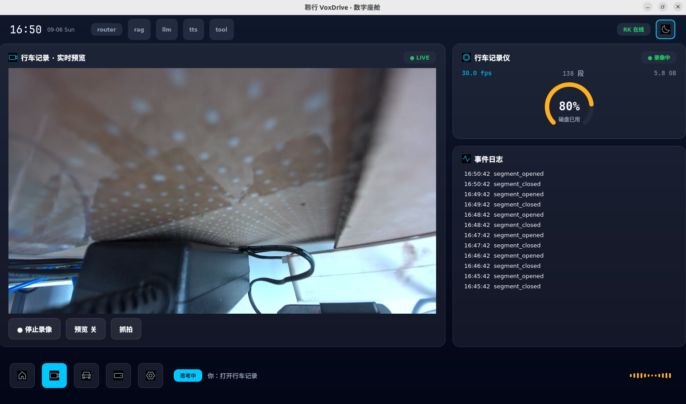
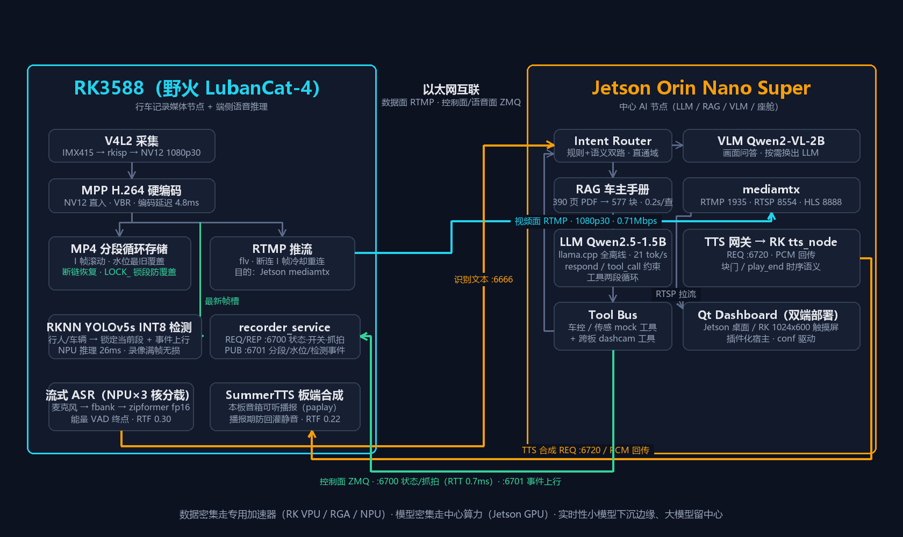
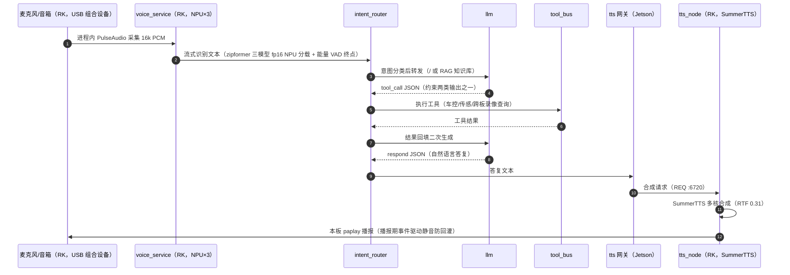
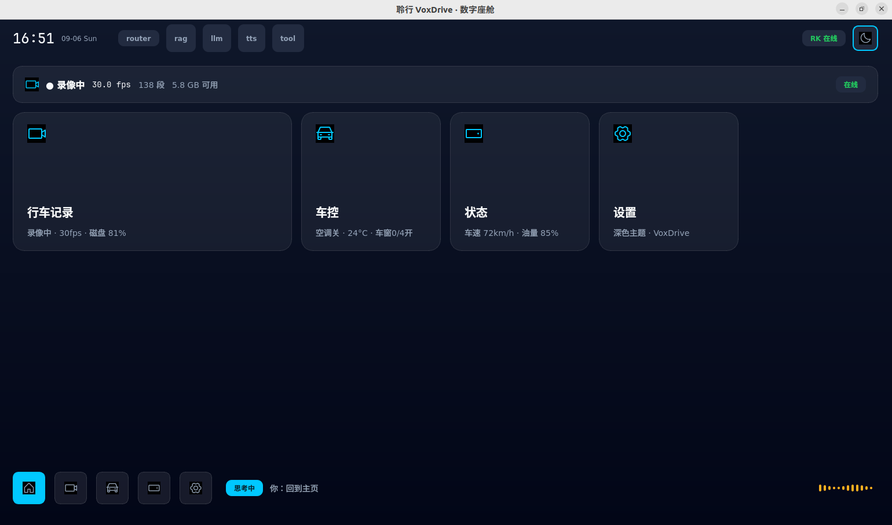
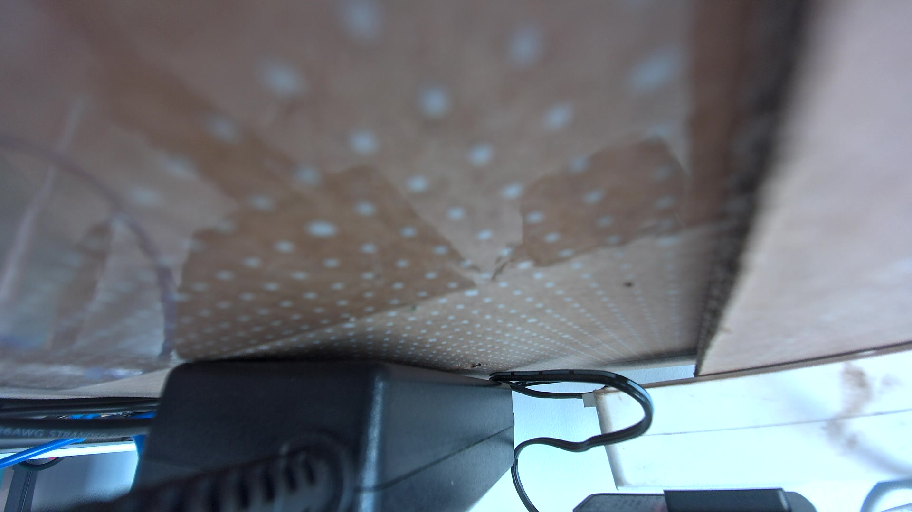

# 聆行 VoxDrive — 分布式车载智能座舱系统（RK3588 + Jetson Orin 双板）

> 双 SoC 分布式车载智能座舱：**RK3588 作为行车记录媒体节点 + 端侧语音推理节点**（V4L2 摄像头采集 / MPP 硬件编码 / MP4 分段循环存储 / RTMP 推流 / RKNPU 事件锁录 / **流式 ASR 三模型 NPU 分载 + TTS 板端合成**），**Jetson Orin 作为中心 AI 节点**（LLM / RAG / 视觉问答 VLM / 意图路由 / Qt 座舱界面）。两板以太网互联，视频流走 RTMP、控制与状态走 ZeroMQ，实现"语音控制行车记录、画面预览、录像与存储状态查询、画面内容问答"的跨节点全离线闭环；座舱 UI 同一套代码可部署在 Jetson 桌面或 RK 触摸屏（conf 驱动，通信拓扑不变）。

**状态：核心功能全部实测完成（R1-R10、R13-R15）；2026-09-06 三轮验证全绿（第二轮全量 RK 5/5 + Jetson selftest 8/8 + 回归 4/4×2；第三轮性能复测见实测表末行，含防回灌静音确认修复）**

- ✅ Jetson 侧：七服务全栈一键启动 + 回归 4/4 PASS；语义双路意图路由（留出探针 15/15）；RAG 真实车主手册（390 页 PDF→577 块向量库）
- ✅ RK3588 侧：采集 30.0fps → MPP 硬编（延迟 4.8ms）→ 分段循环存储 → RTMP 推流 → ZMQ 状态/事件服务 → **YOLOv5s INT8 事件锁录（NPU 推理 25.3ms ewma，录像满帧无损）**
- ✅ 跨板闭环：语音查询/控制/抓拍全通（跨板 REQ RTT 2ms，语音闭环全程 3.55-5.47s）；Qt 座舱**双端部署**（Jetson 桌面 + RK 1024x600 触摸屏，真屏验证）
- ✅ R14 语音推理下沉：流式 zipformer 三模型 fp16 NPU 三核分载（**RTF 0.26-0.30，线上转写与 fp32 基线逐字一致**）+ SummerTTS 板端多核合成（**RTF 0.22-0.27**）；麦克风/音箱（USB 组合设备）在 RK，声学自环真麦验证逐字正确
- ✅ R15 视觉问答：语音"画面里有什么"→ 直通 **Qwen2-VL-2B 端侧推理**（按需换出 LLM 的生命周期管理），应答与画面实测一致



## 系统架构



**任务划分原则**：数据密集型任务走专用加速器（RK3588 的 VPU/RGA/NPU），模型密集型任务走中心算力（Jetson GPU/统一内存）；扩展原则——**实时性敏感、算力可承担的小模型（ASR/TTS）下沉边缘 NPU/CPU，大模型（LLM/VLM）留中心**。主码流 NV12 由 ISP 直出、免格式转换直入 MPP，RGA 不在主链路，用于检测前处理缩放与预留子码流。

## 功能流程

### 1. 行车记录管线（RK3588）

```
IMX415 (RAW Bayer, 4-lane MIPI)
  └─► rkcif ──► rkisp（3A 统计，rkaiq 引擎按需启用）
        └─► mainpath /dev/video11 输出 NV12 1920x1080@30fps
              └─► V4L2Capture：mmap 4 缓冲轮询出队，DMA-BUF 导出
                    └─► MppEncoder：NV12 直入 MPP 编码 H.264（VBR 4Mbps，GOP 2s）
                          ├─► Mp4SegmentSink ──► ~/voxdrive_records/seg_YYYYmmdd_HHMMSS.mp4
                          └─► RtmpSink      ──► rtmp://<mediamtx>/live/dashcam
```

- **分段循环存储**：段边界严格落在 I 帧（每段独立可解码）；PTS 在段内归零后重采样到 1/90000 时基；`statvfs` 监控磁盘水位，超过阈值（默认 85%）按最旧优先删除已关闭段，**永不删正在写的当前段**；写失败（磁盘满/设备掉线）立即关闭当前段，在下一个 I 帧自动重开新段——长时间录制不中断。
- **推流与存储互不牵连**：RTMP 断连时推流侧只丢弃非 I 帧，按"I 帧到达 + 冷却期满"节奏重连，录像管线不受影响；两路消费者互为独立实现，均挂在 `IVideoSink` 接口下，可单独启停或替换。

### 2. 状态查询与事件上行（ZMQ 双通道）

所有跨板消息使用统一信封，新增数据类型（GPS/IMU/检测事件…）只需扩展 `type` 字段，不改协议：

```json
{"version": 1, "type": "status", "timestamp_ms": 1725360000000,
 "source": "rk.recorder", "payload": {"cmd": "status"}}
```

**REQ/REP（:6700，控制面）**——Jetson 侧随时查询与控制：

```json
{"recording": true, "pipeline_fps": 30.0, "frames_encoded": 474, "uptime_s": 15.8,
 "storage": {"dir": "...", "segments_total": 4, "used_percent": 52.0, "free_gb": 13.9},
 "rtmp": {"...": "推流状态快照"}}
```

支持命令：`status`（如上快照，含 `preview` 与 `rtmp` 字段）、`set_recording`（录像开关，暂停期间编码照常、仅不落盘）、`set_preview`（预览推流开关，关=立即断流、开=下个 I 帧自动重连）、`snapshot`（应答信封 type=snapshot，携带 `jpeg_b64`）。

**PUB/SUB（:6701，事件面）**——异常实时上行座舱告警：

| 事件 | 触发条件 |
|---|---|
| `segment_opened` / `segment_closed` | 分段滚动 |
| `watermark_deleted` | 磁盘超水位，删除最旧段 |
| `write_error` | 写失败进入断链恢复 |
| `capture_timeout` | 采集超时断流（只报首次，防风暴） |

### 3. 语音问答链路（推理与音频 I/O 在 RK，LLM/RAG 留 Jetson，全离线）



规则与语义双路意图识别（语义通路=离线意图中心向量余弦，阈值留出探针实测校准；规则通路兜底并在紧急/指令/实时车况域优先）；LLM 输出被约束为 `respond` / `tool_call` 两类 JSON，工具调用走"调用→回填→再生成"两段循环。跨板工具（录像/存储状态查询、抓拍、预览开关）由 tool_bus 经上述 ZMQ 双通道访问 RK 节点。ASR 走 fp16 而非 INT8 是实测定稿：INT8 全套量化精度分析不满足流式精度（encoder 单块 cos 0.92 但流式状态累积崩溃 cos 0.594），fp16 零量化损失且 RTF 0.263 余量充足。

**视觉问答（VLM，R15）**：语音问"画面里有什么"→ router vlm 直通 → vlm_service 抓取 RK 最新帧（跨板快照 0.35s）→ 宿主降采样 960×540（1080p 原图 ~2700 image token 爆 2k 上下文）→ Qwen2-VL-2B（q4km + mmproj q8，llama.cpp mtmd）推理作答 → 恢复原 LLM → TTS 播报。8GB 统一内存上 VLM 与全栈共存不可行，采用**按需换出**生命周期（停 llm 的 llama-server → fadvise 清页缓存 → 起 VLM → 应答后恢复），恢复后常规查询回归无损。

**行车记录仪（dashcam）域走确定性直通**：关键词命中即直接执行跨板工具，LLM 仅负责把真实工具结果组织成播报文本——不把真设备控制交给 1.5B 小模型在 7 个工具间选择（实测它会选错："关闭预览"→车窗全关、"还剩多少存储"→读 mock 传感器编数）。异常事件（水位删除/写失败/采集超时/推流中断/**检测到行人车辆**）由 RK 经事件 PUB 上行，dashboard 订阅后弹告警横幅。

**事件锁录（RK3588 NPU）**：RK 节点在录像管线旁挂一条检测线程——每 30 帧取最新帧（忙时覆盖、不反压采集），RGA 转 RGB 后送 RKNN YOLOv5s INT8（NPU core0，推理 ~25ms）检测行人/车辆；命中即锁定当前录像段（LOCK_ 前缀改名，循环覆盖时豁免删除，配额超限自动释放最旧），事件同步上行 Jetson 告警。

## 实现方案

### RK3588 侧（`rk/`）

**接口分层**——采集与消费解耦，一帧编码输出可多路扇出：

```cpp
IVideoSource  { start / stop / acquire / release }      // V4L2Capture 实现
IVideoSink    { start(sps_pps) / on_packet / stop }      // Mp4SegmentSink、RtmpSink 实现
EncodedPacket { Annex-B H.264 访问单元 + is_keyframe + 时间戳 }
```

| 模块 | 实现要点 |
|---|---|
| `capture/v4l2_capture` | mplane API；格式以 `G_FMT` 实际协商值为准；`REQBUFS`+`mmap` 4 缓冲、`EXPBUF` 导出 DMA-BUF；分片 `poll` 等待保证停流响应；`STREAMOFF` 安全停止 |
| `encode/mpp_encoder` | NV12 同制式直入 MPP（零格式转换）；VBR 目标 4Mbps（1.5x/0.5x 上下限）；GOP=fps×2s；`MPP_ENC_GET_EXTRA_INFO` 取 SPS/PPS；关键帧判定扫描包内**全部** NAL（MPP IDR 包带 SEI 前缀，只看首 NAL 会漏判） |
| `storage/mp4_segment_sink` | libavformat 封装；movenc 不代转 Annex-B——写帧前逐 NAL 转 AVCC 4 字节长度前缀，SPS/PPS 手工组装 avcC extradata；起始码前导零归属、末 NAL 边界两处 off-by-one 用统一扫描器解决（症状是 duration 正常但解码全错，必须逐段解码校验） |
| `stream/rtmp_sink` | flv over RTMP（libavformat，与 MP4 共用 AVCC 转换）；连接超时/读写超时分离；断连后丢弃非 I 帧，按"I 帧 + 冷却间隔"重连，重连成功即恢复完整可解码流 |
| `service/recorder_service` | 管线线程（采集→编码→扇出）+ 控制线程（REP 500ms 轮询）分离；状态快照跨线程加锁（帧率 EWMA 平滑）；事件经 ZmqPub 上行；启动就绪用原子量轮询，杜绝"管线未起即判死"竞态 |

**ZMQ 通信**：复用自研 `zmq-comm-kit`（REQ/REP + PUB/SUB 封装，C++），板端直链编译。

### Jetson 侧（`jetson/`）

- **公共地基 `common/`**：`voxdrive.conf` 统一管理全部端口/路径/超时（含 RK 节点地址，网络形态变化不改代码）；`vox_log` 毫秒时间戳日志（延迟对账地基）；`msg_envelope` 跨板消息信封；vendored nlohmann/json。
- **七服务**：asr（Jetson 侧仅存 stdin_asr 键盘注入联调工具；线上语音入口为 RK 侧 `rk/voice/voice_service`：fbank→NPU 流式解码→REQ 路由）、intent_router（规则+语义双路，`respond`/`tool_call` 两类 JSON 约束 + dashcam/vlm 域直通）、rag（车辆手册向量库，阈值过滤 + embed 端点）、llm（llama.cpp server HTTP 代理）、tool_bus（本地车控/传感工具 + 跨板工具注册表）、tts（SummerTTS 引擎 + 三端口握手；合成请求转 RK `rk/tts/tts_node` 板端合成、本板可听播报）、dashboard（PyQt5 插件化宿主，Jetson 桌面/RK 触摸屏双端部署）。
- **编排与回归**：`start_core.sh` 路径无关、全 conf 驱动、按依赖排序启动 + 端口健康检查；`run_regression.sh` 4 条典型查询全链路验证。

### 工程化

- **Git 为唯一真源**：本地提交 → `git archive | ssh tar` 增量送板（只送已提交内容）→ 板上编译自测；测试程序放板上独立目录，不污染项目树。
- **板端编译**：RK 侧 g++/cmake 板上原生编译，MPP/RGA 用发行版 dev 包；ffmpeg 头文件经 `setup_ffmpeg_headers.sh` 解包到项目前缀（发行版 rkmpp 运行库与官方 dev 包冲突，不可 apt 安装），链接系统运行库。
- **自测判据硬性化**：每个环节的测试都有 PASS 判据（帧率阈值、逐段全量解码零错误、双通道应答断言），不允许"能跑就算过"。

## 仓库结构

```
jetson/                       # Jetson 侧
  config/voxdrive.conf        #   统一配置（端口/路径/超时/RK 节点地址）
  common/                     #   配置读取·毫秒日志·JSON·消息信封（节点无关）
  services/                   #   asr / intent_router / rag / llm / tool_bus / tts / vlm
  dashboard/                  #   PyQt5 座舱界面（插件化宿主，双端部署）
  scripts/                    #   增量送板·板上编译·自测·启动编排·回归
rk/                           # RK3588 侧（接口化设计）
  include/vox/                #   IVideoSource / IVideoSink / NAL 工具
  capture/ encode/ storage/ stream/ service/ detect/
  voice/                      #   voice_service：麦克风采集 + NPU 流式 ASR + 防回灌
  tts/                        #   tts_node：SummerTTS 板端合成 + 本板播报（REP :6720）
  apps/                       #   test_capture / test_encode / test_record / test_detect / test_rtmp / test_recorder_client
  scripts/                    #   增量送板·板上编译·依赖部署
docs/                         # 工程文档（补充中）
```

## 构建与部署

**RK3588（LubanCat-4 / RK3588S，Ubuntu 22.04）**：

```bash
rk/scripts/setup_ffmpeg_headers.sh   # ffmpeg 头文件前缀（幂等）
rk/scripts/setup_zmq_kit.sh          # zmq-comm-kit 拷板编译（PC 端执行）
rk/scripts/sync_to_rk.sh             # git archive 增量送板（PC 端执行）
rk/scripts/build_on_rk.sh            # 板上编译
# 板上自测：apps/ 下 test_capture / test_encode / test_record / test_rtmp / test_recorder_client
```

**Jetson Orin Nano Super（JetPack 6.x）**：

```bash
jetson/scripts/build_on_board.sh <service>   # 板上编译单个/全部服务
jetson/scripts/start_core.sh                 # Jetson 侧一键全栈（依赖排序 + 端口健康检查）
jetson/scripts/run_regression.sh             # 回归测试
```

模型文件不入库，按清单部署（LLM/ASR/TTS/embedding 四类约 1.7GB）；mediamtx 等第三方二进制另行部署。

### 快速启动（双板一键，Jetson 上执行）

前置（一次性）：Jetson→RK SSH 免密（Jetson 公钥装入 RK `authorized_keys`）。

```bash
~/Desktop/VoxDrive/jetson/scripts/start_all.sh    # 双板一键：探测/SSH 拉起 RK 录像服务 → Jetson 全栈（含 mediamtx）→ 开预览推流；冷启动实测 23.5s
~/Desktop/VoxDrive/jetson/scripts/stop_all.sh     # 双板一键停止服务
~/Desktop/VoxDrive/jetson/scripts/shutdown_all.sh # 双板一键安全关机（优雅停服务收好当前录像段 → SSH 关 RK → 本机倒计时关机）
# 可选：start_all --no-preview 只录像不推流；VOX_START_DASHBOARD=1 同时启动 Qt 座舱 GUI（需桌面会话）
# shutdown_all --no-self 只关 RK / --dry-run 只打印动作
```

启动后即可用键盘注入语音查询（走完整 router→跨板工具→LLM→TTS 链，扬声器播报）：

```bash
python3 ~/Desktop/VoxDrive/jetson/services/asr/stdin_asr.py
# 逐行输入，Ctrl+C 退出：
#   现在录着吗              → 播报真实状态（录像/预览/帧率/水位，rtt=2ms）
#   行车记录仪还剩多少存储    → 播报剩余容量（实测值）
#   帮我拍张照               → 1080p JPEG 落盘 Jetson ~/voxdrive_snapshots/
#   停止录像 / 开始录像       → 真实开关 RK 录像并回读确认
#   打开预览 / 关闭预览       → 开关 RTMP 推流
#   打开空调制冷模式          → LLM 工具两段循环（演示 mock 车控路径）
#   画面里有什么             → vlm 直通：抓 RK 最新帧 → Qwen2-VL-2B 作答
```

真麦语音入口在 RK 板（麦克风/音箱 USB 组合设备）：`rk/scripts/start_voice.sh` 拉起 voice_service（NPU 流式 ASR）+ tts_node（板端合成、本板播报、播报期防回灌），识别文本经 ZMQ 送 Jetson 路由。

同一网段浏览器打开 `http://<jetson-ip>:8888/live/dashcam` 可直接观看行车画面（HLS）。

## 运行实景（RK3588 1024x600 触摸屏真屏）



同一套 dashboard 代码 conf 切换部署在 RK 触摸屏（逻辑 1600x938 经 X 级缩放落到物理 1024x600），数据全部来自跨板实时链路：录像状态/存储水位经 ZMQ :6700 轮询，磁贴点击经 tool_bus 控制真设备，页面切换由语音导航直通驱动（截图中语音气泡「你：回到主页」即上一句语音的执行结果）。



行车记录仪原始快照（1920x1080，rkisp 3A 收敛后直出，跨板抓拍 ~0.15s）。

## 实测数据

> 全部数字为板上实测，附测量方法；未实测项留空不填。

| 指标 | 数值 | 测量方法 | 状态 |
|---|---|---|---|
| LLM 生成速度（Qwen2.5-1.5B Q4_K_M, Jetson Orin Nano Super, -ngl 28 全层 offload） | 22.8 token/s | llama-server 非流式单请求 usage 分解计时（`selftest_llm.sh`，2026-09-03） | 已实测 |
| RAG 检索延迟（CPU 嵌入，45 文档库） | 稳态 ~210 ms/查（首查 591 ms 含预热） | `selftest_rag.sh` REQ 计时，2026-09-03 | 已实测 |
| 语音链路查询延迟（文本→最终答复，含 2 次 LLM 调用+工具执行） | 2.0-5.1 s/条 | `run_regression.sh` 4 条 canned 查询，2026-09-03 | 已实测（不含 ASR/TTS 播报） |
| TTS 播报端到端（合成+ALSA 播放） | 2.7 s（"启动自检测试"短句） | `selftest_tts.sh` 三端口握手计时，2026-09-03 | 已实测 |
| 1080p 采集帧率（RK, IMX415→rkisp NV12） | 30.0 fps（120 帧，max 帧间距 33ms） | `test_capture` 驱动时间戳统计，2026-09-03 | 已实测 |
| 1080p 采集→MPP H.264 硬编（RK） | 30.0 fps；编码延迟 avg 4.8ms / max 8.5ms；全链路 CPU ~2.8%（单核）；静态场景 VBR 实际 0.55Mbps（目标 4Mbps，GOP 2s 节奏 5/5 I 帧）；ffprobe/ffmpeg 全量解码零错误 | `test_encode` 300 帧 + 板上 ffmpeg 校验，2026-09-03 | 已实测 |
| MP4 分段循环录像（RK） | 10s→3 段（测试段长 3s），段边界严格 I 帧；每段 ffmpeg 全量解码零错误；水位触发按最旧序删段且当前段幸免 | `test_record` 分段+水位双相位，2026-09-03 | 已实测 |
| RK ZMQ 服务（REQ 状态查询 / PUB 事件上行） | 状态查询含 recording/pipeline_fps/存储水位（used 52% 实测）；录像开关 off/on 应答正确；慢加入者 SUB 收到 `segment_closed` 事件信封；16s 试跑 4 段全部 ffprobe 有效 | `test_recorder_client` REQ+SUB 双通道自测，2026-09-03 | 已实测 |
| RTMP 推流（回环+跨板真机） | 回环：推流 408 帧与录像一致、断链重连管线不崩；**跨板（RK→路由器→Jetson mediamtx）**：RTSP 拉流 ffprobe h264 1920x1080 30fps、30.2s 全量解码零错误、实测码率 0.71Mbps（静态 VBR 下探，目标 4Mbps），PC 可经 HLS :8888 访问 | `test_rtmp` 回环 + mediamtx v1.20.1 部署后 ffprobe/ffmpeg 拉流，2026-09-04 | 已实测 |
| dashboard 拉流预览 + 状态面板 | ffmpeg 拉 RTSP→BGRA 960x540→Qt 渲染（断流 2s 自动重连）；状态卡片 5s 轮询 RK（30.0fps/段数/水位条实时回读）；REC/预览/抓拍按钮经 tool_bus 控真设备；在线→离线跳变弹告警 | offscreen 截图 + 按钮链路实测，2026-09-04 | 已实测（预览偏绿=暗光下无 3A 传感器表现，调优项） |
| 跨板语音闭环（dashcam 域 6 类查询：状态/存储/抓拍/录像开关×2/预览开关） | 6/6 命中真实设备：应答含实测值（磁盘 52%/剩余 14.6GB、快照 1920x1080 183KB 落盘 Jetson）；RK 状态回读与指令一致。延迟分解（文本进入→TTS 文本发出）：控制类 0.43-0.53s、状态查询 1.0-2.1s、抓拍 3.3s；其中跨板工具 RTT 仅 2-10ms（抓拍 150ms 含 RK 端 JPEG 编码+183KB 跨板传输），其余为 LLM 组织耗时 | intent_router 毫秒日志逐级打点，2026-09-04 | 已实测（ASR 麦克风入口与 TTS 播放时长未计入，stdin_asr 注入文本） |
| 异常事件→dashboard 告警（跨板 PUB/SUB） | RK 水位删除事件（`--watermark 40` 触发真实删除）经 :6701 PUB 上行，Jetson dashboard 订阅实时收到并弹告警横幅；事件信封含 file/segments_deleted/used_percent。注意两板时钟偏差 ~4.2s（Jetson 快），跨板延迟对账以信封 `timestamp_ms` 为准 | RK 服务日志与 dashboard 事件日志对账，2026-09-04 | 已实测 |
| 语音端到端延迟（ASR→TTS 播报结束） | 分解（文本注入口径，4 条代表查询）：入口→router 应答 0.87-1.04s（关键词命中 <1ms + 跨板工具 RTT 2-10ms/抓拍 143ms + LLM 组织 0.86-1.07s）；TTS 合成+播放 6字句 2.68s / 15字句 4.49s（含音频时长本身）；**全程→play_end 3.55-5.47s**。ASR 引擎段（WAV 回放口径）：流式 zipformer int8 双线程 RTF 0.16-0.18（4.69s 音频纯解码 0.83s，模型加载 2.5s 一次性摊销），中英混识别正确；真实 mic 口径含 VAD 端点静音窗，需真人测试（未计入） | intent_router/tts 毫秒日志 + play_end PUB 事件 + sherpa-onnx CLI 计时，2026-09-04 | 已实测 |
| 长稳快照（双板全栈联跑） | 16min：RK 管线 fps 稳定 30.00、29417 帧编码、frames_dropped=765 与"录像暂停"总时长精确对账（设计性丢弃）；RSS 稳定 recorder 53MB / tts 371MB / mediamtx 47MB / tool_bus 8MB；期间跨板查询/抓拍/预览/回归全部正常；离线注入故障（杀 RK）→ 5s 精确超时应答、总线存活、恢复即自愈 | 双板进程状态 + RK status 快照 + 日志对账，2026-09-04 | 已实测（过夜长稳挂起中） |
| 语义双路路由（E1） | 留出探针正确率 **15/15**（5 类意图：EMERGENCY/EXPLICIT_CMD/FACTUAL/COMPLEX/CREATIVE；chinese-macbert 768d 意图中心余弦，运行时编码经 RAG embed 端点）；阈值实测校准 0.51-0.66；改述事实查询（关键词全 miss）走 RAG-only 快路径：**8.8-9.4s → 0.8-1.2s**；语义故障自动退化为规则单路 | `build_intent_centers.py --calibrate`（探针与构建样本不重叠）+ router REQ 打点 8 句验证，2026-09-04 | 已实测 |
| RAG 真实车主手册语料 | BYD 汉 EV 官网车主手册 PDF（390 页，文本型）→ pypdf 页级提取 → 分块 577 块（目录页/目录型块/正文页眉行三级过滤）→ macbert CPU 编码入向量库；实测手册内改述句 top1 相似 0.487-0.498、手册外噪声句 0.39-0.472，据此定召回阈值 0.48；规格类查询（保养周期/胎压/电耗）直接命中真实手册内容 | `extract_manual_pdf.py` + `build_vector_db.py` 板上构建；相似度分布逐句实测，2026-09-04 | 已实测（语料板端部署不入库，仓库带 mock 语料可一键重建） |
| 跨板查询往返延迟 | REQ rtt=2ms（Jetson tool_bus → RK recorder_service，ZMQ 消息信封，路由器当交换机同段） | `dashcam` 工具联测计时，2026-09-04 | 已实测 |
| 跨板抓拍（JPEG over ZMQ） | 1080p JPEG ~195KB（NV12→mjpeg 软编 + base64 REQ/REP）跨板落盘 Jetson，`file` 验证有效图像；录像/预览开关状态回读一致 | `dashcam` 全动作联测，2026-09-04 | 已实测 |
| RKNN 事件锁录（E2/R10） | YOLOv5s INT8 640×640 单模型 NPU core0：推理 **25.3ms ewma / 27.1ms max**（1fps 取样，检测线程最新帧槽不反压主管线），采集全程 30.0fps 与无检测基线无损；锁段=LOCK_ 前缀改名，水位 1% 删除风暴中锁段幸存（ffprobe 有效）、配额超限自动释放最旧（test_record 锁段两相位连续两轮 PASS）；detect 事件经 :6701 上行→Jetson dashboard 弹「检测到行人/车辆，当前录像段已锁定保护」横幅（注入法+截图验证；检测→锁段端由 test_detect/test_record 真实验证，真实目标触发待场景有行人/车辆复测） | `test_detect` / `test_record` 阶段C/D + status detect 段（90s 推理 184 次与 1fps 吻合）+ dashboard 截图，2026-09-05 | 已实测 |
| dashboard 双端部署（R13，RK 触摸屏） | 同一套 dashboard 代码 conf 切换跑 RK 1024x600 DSI 屏（Goodix 触摸，X 级 randr 缩放 1.5625x 到逻辑 1600x938）；真屏验证：主页磁贴真实跨板数据、语音"打开行车记录"→RK 屏切页+自动预览 RTSP 渲染、色彩正确；Jetson UI 与 RK 触摸 UI 双端并存订阅；CPU 空闲 3.0%（单核）、预览拉流 13.0% | 真机 VNC + offscreen 冒烟 + /proc stat 20s 均值，2026-09-05 | 已实测 |
| ASR 推理下沉（R14，RK NPU） | zipformer 三模型 fp16 RKNN 三核分载（enc core0 / dec core1 / joiner core2）：**RTF 0.263**；线上流式转写与 Jetson ORT fp32 贪心**逐字一致**；fbank 前端与 sherpa C++ 逐位一致（对拍 maxabs=0）；INT8 全套量化精度分析不满足流式精度（encoder 单块 cos 0.92/状态 cos 0.594 累积崩溃）→ fp16 定稿 | 隔离 harness + wav_push 注入对照 fp32 基线，2026-09-06 | 已实测 |
| TTS 推理下沉（R14，RK CPU 多核） | SummerTTS 板端：**RTF 0.22-0.27**（7 字句 0.63s、28 字长句 1.47s，OpenMP 多核；第三轮复测 2026-09-06 傍晚），REP :6720 协议对齐 Jetson 网关；播报本板 paplay 可听 + 播报期事件驱动静音防回灌（tts_say/play_end 订阅 + **解除须等麦克风真实静音 ≥1s**（play_end 是 Jetson 写入完成事件、早于本板实时播完，实测修复前后：长答复播报引发 3 次回灌级联 → 0 次）+ 30s 超时兜底） | tts_node 日志墙钟 + play_end 对账 + 修复前后级联对比，2026-09-06 | 已实测 |
| 真麦声学闭环（R14，USB 组合设备） | 麦克风+音箱同一 USB 设备接 RK：播合成命令→空气→麦克风→NPU 识别 final **逐字正确**→router 真数据应答（129 段/71%/8.8GB）→本板播报→无二次识别无循环 | 真机声学自环实测，2026-09-06 晚 | 已实测（真人开口留待用户） |
| VLM 画面问答（R15，Qwen2-VL-2B） | 语音"画面里有什么"→ vlm 直通→抓帧 0.35s + 推理 4.7s + 恢复 llm 14.9s（冷启动含模型加载 ~25-30s）；应答与画面实测一致；恢复后回归 4/4 无损；GPU 铁律实测：共存必 OOM（mmproj 677MB）/ 换出后须 evict 页缓存 / ctx 2048+图降采样 960×540 | router REQ 打点 + vlm_service/llama-server 生命周期日志，2026-09-06 | 已实测 |
| 第二轮全量验证（2026-09-06） | RK 5/5（capture 30.0fps / encode+色度 4.73ms / record 锁段水位 / detect ewma 26.0ms / zmq 5 断言）+ Jetson selftest 8/8 + 回归 4/4×2 + E2E（RTSP 90 帧解码零错误、RGB 色度中性 114/122/131、HLS 302、dashcam 语音查询 rtt 1.6-2.2s 含真实值、跨板抓拍 123ms 落盘 JPEG） | 逐项测试断言见 AGENTS.md 第 6 节验证体系梳理 | 已实测 |
| 第三轮性能复测（2026-09-06 傍晚，全栈在线） | 跨板 REQ RTT **avg 0.73ms**（0.64-0.83，n=20）；RK 管线 30.001fps 连续录像 1.5h+（154k 帧、RTMP 零写错误、detect ewma 26.2ms）；LLM 20.5-21.0 tok/s（llama.cpp 纯生成口径 ×3）；RAG 208-280ms/查；ASR fp16 NPU RTF **0.296**（10.1s 中英混，转写与 fp32 基线逐字一致）；TTS RTF **0.219-0.267**；E2E（防回灌修复后干净口径）：router 应答 1.49-4.14s、→play_end 7.03-17.91s（=答复文本+合成+实时音频时长，自洽）；RTSP 在线 h264 1080p30 ffprobe 确认 | 双板探针脚本计时：跨板 REQ n=20 / LLM ×3 / RAG ×3 / TTS ×2 / E2E ×3，全栈在线；E2E 串行发查询（等上一条播完）排除 TTS 队列伪影，2026-09-06 | 已实测 |

## Roadmap

- [x] zmq-comm-kit 通信库上 Jetson 编译验证（REQ/REP + PUB/SUB 回环）
- [x] Jetson 七服务收编 + 标准重构（统一配置/公共 JSON/毫秒日志/死代码清理；七服务全部板上自测 PASS，`start_core.sh` 一键全栈启动 + `run_regression.sh` 4/4 PASS）
- [x] mediamtx v1.20.1 RTMP/RTSP/HLS 服务上 Jetson（`start_core.sh` 一键编排；gh-proxy 镜像获取）
- [x] RK3588 硬件链路验证 + 采集层（野火 LubanCat-4/RK3588S + IMX415 MIPI；`IVideoSource`/`IVideoSink` 接口抽象 + `V4L2Capture` mmap/DMA-BUF 实现，NV12 1920x1080 实测 30.0fps 板上自测 PASS）
- [x] RK3588 MPP H.264 硬编（NV12 直入 VBR，30fps/编码延迟 4.8ms/全链路 CPU 2.8%，ffmpeg 全量解码校验通过；RGA 留作子码流缩放）
- [x] RK3588 MP4 分段循环录像（libavformat 封装，I 帧边界滚动分段/水位最旧覆盖/断链恢复，逐段解码校验）
- [x] RK ZMQ 服务（`recorder_service`：V4L2→MPP→MP4 管线线程 + REP 状态/录像开关 + PUB 事件上行，统一消息信封；`test_recorder_client` 双通道自测 PASS）
- [x] RK3588 RTMP 推流（`RtmpSink` flv over rtmp：avcC/AVCC 转换与 MP4 共用、I 帧+冷却断链重连；回环两相位自测 PASS + 跨板真机 mediamtx 拉流 30.2s 解码零错误、实测 0.71Mbps）
- [x] 跨板工具（`dashcam`：状态查询 rtt 2ms / 录像与预览开关 / 抓拍 JPEG 跨板落盘；RK 端配套 `set_preview`/`snapshot` 命令）
- [x] 语音闭环（dashcam 域关键词确定性直通：LLM 选工具不可靠→命中即执行，LLM 仅组织真实结果；6 类查询全通，控制类文本链路 0.43-0.53s）+ 异常事件 dashboard 告警横幅（水位删除事件实测触达）
- [x] dashboard 拉流预览面板 + 录像/存储状态卡片（ffmpeg RTSP→Qt 渲染 + 5s 状态轮询 + 真设备按钮 + 离线告警）
- [x] 端到端延迟分解实测（ASR 引擎 RTF 0.16-0.18 / 全程入口→播报结束 3.55-5.47s，见实测表）+ 长稳快照（16min 全栈联跑零异常，过夜长稳挂起）
- [x] 语义双路意图路由真实现（E1：RAG embed 端点 + 意图中心余弦 + 双路融合；留出探针 15/15，改述句 RAG-only 快路径 9.4s→1.2s）+ RAG 真实车主手册语料（390 页 PDF→577 块向量库，板端构建）
- [x] RKNN 事件锁录（E2/R10：rk/detect 单模型 NPU 推理 25ms 级 + LOCK_ 锁段防覆盖（水位豁免+配额释放）+ detect 事件跨板告警横幅；管线 30fps 无损）
- [x] dashboard 双端部署（R13：RK 1024x600 DSI 触摸屏真屏验证，conf 切换零改动，双端并存）
- [x] ASR/TTS 推理下沉 RK（R14：zipformer 三模型 fp16 NPU 三核分载 RTF 0.263 转写逐字一致 + SummerTTS 板端合成 RTF 0.31 + 本板可听播报与防回灌；真麦声学自环验证；INT8 量化精度分析全套实测支撑 fp16 选型）
- [x] 视觉问答 VLM（R15：Qwen2-VL-2B 端侧推理按需换出 LLM，应答与画面实测一致；GPU 内存三条铁律实测沉淀）
- [x] 第二轮全量验证（2026-09-06：RK 5/5 + Jetson selftest 8/8 + 回归 4/4×2 + E2E 抽查全绿）
- [x] 第三轮性能复测（2026-09-06 傍晚，全栈在线：跨板 RTT 0.73ms / LLM 21 tok/s / ASR RTF 0.296 / TTS RTF 0.22-0.27 / E2E 干净口径，见实测表）+ 防回灌静音确认修复（play_end 早于实时播完导致长答复回灌级联 → 解除改等真实静音，级联 3→0）
- [ ] 主/子双码流、录像回放检索（可选）

## License

MIT
